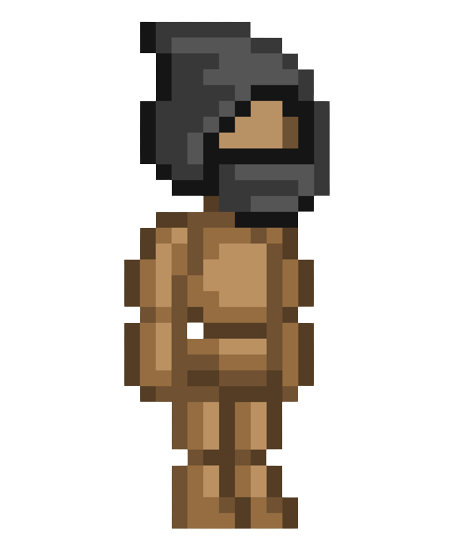

# Game_wandering_king
# Rules

Rules are simple, don't get caught by robbers: 
 - 

 - You have 5 arrows fire them by pressing **SPACEBAR** number of arrows left is in bottom-right corner
 - Move by pressing **ARROWS**
 - Colect **AMMO KIT** to refill amunition
 - 
 - **AMMO KIT** change location when collected
 - You have three **LIVES** in the game, you lose one every time robber touches you
 - **LIVES** are visible in upper-left corner
 - 

# Upgrades
 - When you kill 50 and 100 enemies you gain **+5** ammo capacity
 - When you die you also gain **+5** ammo capacity

# Skills
  - **Q** Release tornado which swipes all enemy on its way
  - 

  - **W** Freeze all enemies, player is **immune** during freeze
  - 

  - **E** Reloads magazine with slower but explosive bombs! 
  - 

 Images used in game may be licensed please use only for personal purposes

